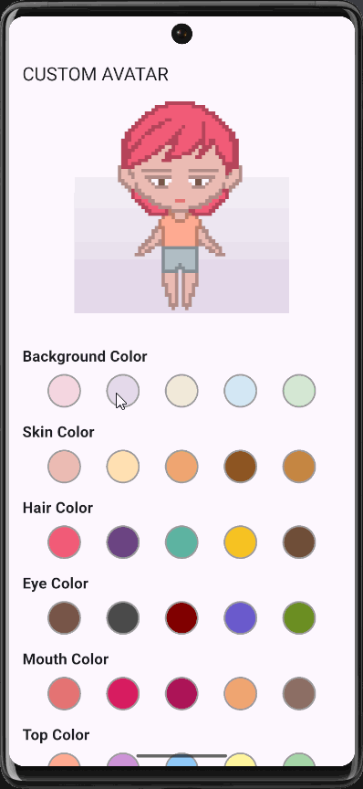

<div align="center">
  <h3><a href="#readme-top-en">Click here for English README</a></h3>
</div>
<a id="readme-top"></a>

# Flutter Custom Avatar

<br />
<div align="center">

  <h3 align="center">Flutter 아바타 커스터마이징 프로젝트</h3>

  <p align="center">
    Flutter로 픽셀 아트 아바타를 커스터마이징하고 애니메이션을 적용하는 프로젝트입니다.
    <br />
  </p>
</div>

## 주요 기능

* **아바타 커스터마이징**: 아바타의 각 파츠(몸, 머리, 눈 등)별로 원하는 색상을 선택할 수 있습니다.
* **픽셀 아트 스케일링**: 64x64 픽셀의 픽셀 아트 에셋을 `Transform.scale`을 사용하여 4배 확대하여, 픽셀 아트의 느낌을 유지하면서도 화면에 적절한 크기로 표시합니다.
* **프레임 애니메이션**: 몸통 부분이 두 이미지 사이를 주기적으로 전환하며 간단하게 움직이는 애니메이션 효과를 연출합니다.
* **성능 최적화**: `Timer.periodic`을 사용한 직접적인 이미지 교체 방식으로, `ColorFiltered` 위젯과 애니메이션 위젯의 충돌 문제를 해결하여 깜빡임 없이 부드러운 전환을 구현했습니다.

<p align="right">(<a href="#readme-top">맨 위로 돌아가기</a>)</p>

## 프로젝트 구조

`lib/` 폴더 내에 코드를 기능별로 분리하여 관리합니다.

```
flutter_custom_avatar/
├── android/
├── ios/
├── lib/
│   ├── main.dart             # 메인 앱의 진입점
│   └── custom_avatar/
│       ├── avatar_data.dart        # 아바타 관련 정적 데이터(색상 팔레트)
│       ├── avatar_parts.dart       # 아바타 파츠를 렌더링하는 위젯들
│       ├── color_selector.dart     # 색상 선택 UI 위젯
│       └── custom_avatar.dart      # 아바타 화면의 상태 및 로직 관리
├── assets/
│   └── images/
│       ├── body_1.png
│       ├── body_2.png
│       ├── top.png
│       ├── bottom.png
│       ├── mouth.png
│       ├── eyes.png
│       ├── eyes_background.png
│       └── hair.png
├── pubspec.yaml              # 의존성 및 에셋(assets) 설정 파일
└── README.md
```

<p align="right">(<a href="#readme-top">맨 위로 돌아가기</a>)</p>

## 코드 설명

프로젝트 코드는 기능별로 여러 파일로 분리되어 있습니다.

* **`main.dart`**: 앱의 진입점(Entry Point)이자 `MaterialApp`을 설정하는 파일입니다. 앱의 전반적인 테마를 정의하고 `CustomAvatar` 위젯을 화면에 표시합니다.
* **`custom_avatar/custom_avatar.dart`**: 아바타 커스터마이징 화면의 핵심 로직을 담당하는 `StatefulWidget`입니다. 사용자가 선택한 색상 상태를 관리하고, 애니메이션을 위한 타이머 로직을 처리하며, 다른 하위 위젯들을 조립하여 전체 화면을 구성합니다.
* **`custom_avatar/avatar_data.dart`**: 아바타의 각 파츠(부위)에 사용되는 모든 색상 팔레트를 `static` 변수로 정의하여 중앙 집중식으로 관리하는 파일입니다.
* **`custom_avatar/avatar_parts.dart`**: 아바타를 구성하는 개별 이미지 파츠들을 렌더링하는 위젯들이 담겨있습니다. `ColorFiltered`를 사용해 색상을 적용하거나, 적용하지 않는 등 파츠의 성격에 따라 분리되어 있습니다.
* **`custom_avatar/color_selector.dart`**: 각 파츠의 색상을 선택할 수 있는 UI를 제공하는 재사용 가능한 `StatelessWidget`입니다. 선택된 색상에 대한 이벤트를 부모 위젯에 전달합니다.

<p align="right">(<a href="#readme-top">맨 위로 돌아가기</a>)</p>

## 애셋 (Assets)

이 프로젝트에 사용된 모든 픽셀 아트 이미지(아바타 파츠 등)는 이 프로젝트의 기여자(alicia6-6)가 직접 제작했습니다.

<p align="right">(<a href="#readme-top">맨 위로 돌아가기</a>)</p>

## 시작하기

1. 프로젝트를 클론하거나 코드를 복사합니다.
2. `assets/images` 폴더에 필요한 이미지 파일들을 추가합니다.
3. `pubspec.yaml` 파일에 `assets` 섹션을 다음과 같이 추가합니다.

   ```yaml
   flutter:
     uses-material-design: true
     assets:
       - assets/images/
    ```

4.  터미널에서 `flutter pub get` 명령어를 실행합니다.
5.  `lib/main.dart` 파일을 열고 프로젝트를 실행합니다.


<p align="right">(<a href="#readme-top">맨 위로 돌아가기</a>)</p>

## 라이선스

이 프로젝트는 MIT 라이선스를 따릅니다. 자세한 내용은 `LICENSE` 파일을 참조하세요.

<p align="right">(<a href="#readme-top">맨 위로 돌아가기</a>)</p>

<br />

---

<br />

<a id="readme-top-en"></a>

# Flutter Custom Avatar

<br />
<div align="center">

  <h3 align="center">Flutter Avatar Customization Project</h3>

  <p align="center">
    A Flutter project for creating a customizable pixel art avatar with a simple animation.
    <br />
  </p>
</div>

## Features

* **Avatar Customization**: Users can select and apply different colors to each part of the avatar (body, hair, eyes, etc.).
* **Pixel Art Scaling**: The 64x64 pixel art assets are enlarged by a factor of 4 using Transform.scale to maintain the pixel art aesthetic while displaying them at a suitable size on the screen.
* **Frame-by-Frame Animation**: The body animates by cycling between two images, creating a subtle 'moving' effect.
* **Performance Optimization**: The project uses a direct image-swapping method with `Timer.periodic`, which resolves flickering issues caused by opacity animations conflicting with the `ColorFiltered` widget.

<p align="right">(<a href="#readme-top-en">back to top</a>)</p>

## Project Structure

```
flutter_custom_avatar/
├── android/
├── ios/
├── lib/
│   ├── main.dart             # Main application entry point
│   └── custom_avatar/
│       ├── avatar_data.dart        # Static data for avatar parts (color palettes)
│       ├── avatar_parts.dart       # Widgets for rendering avatar parts
│       ├── color_selector.dart     # Color selection UI widget
│       └── custom_avatar.dart      # Manages avatar screen state and logic
├── assets/
│   └── images/
│       ├── body_1.png
│       ├── body_2.png
│       ├── top.png
│       ├── bottom.png
│       ├── mouth.png
│       ├── eyes.png
│       ├── eyes_background.png
│       └── hair.png
├── pubspec.yaml              # Dependencies and assets configuration file
└── README.md
```

<p align="right">(<a href="#readme-top-en">back to top</a>)</p>

## Code Explanation

The project code is now separated into multiple files based on their functionality.

* **`main.dart`**: The entry point of the application, responsible for setting up `MaterialApp`. It defines the app's overall theme and displays the `CustomAvatar` widget on the screen.
* **`custom_avatar/custom_avatar.dart`**: This `StatefulWidget` manages the core logic for the avatar customization screen. It handles the state of selected colors, manages the timer for the animation, and assembles other child widgets to compose the entire screen.
* **`custom_avatar/avatar_data.dart`**: This file defines all static color palettes used for each avatar part, centralizing data management for other widgets to reference.
* **`custom_avatar/avatar_parts.dart`**: Contains the widgets responsible for rendering individual avatar parts. The parts are separated based on whether they use `ColorFiltered` to apply colors or not.
* **`custom_avatar/color_selector.dart`**: A reusable `StatelessWidget`

<p align="right">(<a href="#readme-top-en">back to top</a>)</p>

## Assets

All pixel art images (avatar parts, etc.) used in this project were created by the project contributor (alicia6-6).

<p align="right">(<a href="#readme-top-en">back to top</a>)</p>

## Getting Started

1.  Clone the project or copy the code.
2.  Add the necessary image files to the `assets/images` folder.
3.  Add the `assets` section to your `pubspec.yaml` file as follows:

    ```yaml
    flutter:
      uses-material-design: true
      assets:
        - assets/images/
    ```

4.  Run `flutter pub get` in your terminal.
5.  Open `lib/main.dart` and run the project.

<p align="right">(<a href="#readme-top-en">back to top</a>)</p>

## License

This project is distributed under the MIT License. See the `LICENSE` file for more information.

<p align="right">(<a href="#readme-top-en">back to top</a>)</p>